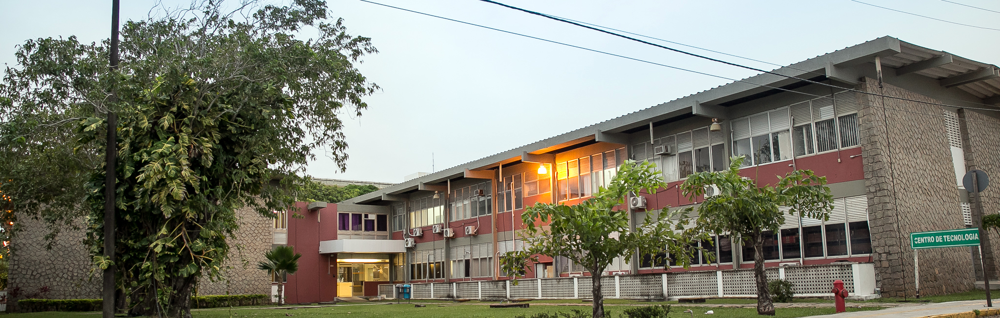

# Federal University of Rio Grande do Norte
## Technology Center
### Graduate Program in Electrical and Computer Engineering
#### Department of Computer Engineering and Automation 
##### EEC1509 Machine Learning

#### References

- :books: Aurélien Géron. Hands on Machine Learning with Scikit-Learn, Keras and TensorFlow. [[Link]](https://www.oreilly.com/library/view/hands-on-machine-learning/9781492032632/)
- :books: François Chollet. Deep Learning with Python. [[Link]](https://www.manning.com/books/deep-learning-with-python-second-edition)
- :books: Hannes Hapke, Catherine Nelson. Building Machine Learning Pipelines. [[Link]](https://www.oreilly.com/library/view/building-machine-learning/9781492053187/)
- :books: Noah Gift, Alfredo Deza. Practical MLOps: Operationalizing Machine Learning Models [[Link]](https://www.oreilly.com/library/view/practical-mlops/9781098103002/)
- :fist_right: Dataquest Academic Program [[Link]](https://www.dataquest.io/academic-program/)

**Week 01**: Course Outline 
- Motivation, Syllabus, Calender, other issues.

**Weeks 02, 03, 04** Machine Learning Fundamentals and Decision Trees 
- Outline 
- What is Machine Learning (ML)? 
- ML types 
- Main challenges of ML
    - Variables, pipeline, and controlling chaos 
    - Train, dev and test sets 
    - Bias vs Variance  
- Decision Trees
    - Introduction  
    - Mathematical foundations 
- Evaluation metrics
    - How to choose an evaluation metric? 
    - Threshold metrics 
    - Ranking metrics 
- :rocket: Case Study 
    - Google Colaboratory  
    - Setup of the environment 
    - Extract, Transform and Load (ETL)
        - Exploratory Data Analysis (EDA) 
        - Fetch Data 
        - EDA using Pandas-Profiling 
        - Manual EDA 
        - Preprocessing 
    - Data Check 
    - Data Segregation 
    - Train
        - Train and validation component 
        - Data preparation and outlier removal 
        - Encoding the target variable 
        - Encoding the independent variables manually 
        - Using a full-pipeline to prepare categorical features 
        - Using a full-pipeline to prepare numerical features 
        - Creating a full-preprocessing pipeline 
        - Holdout training 
        - Evaluation metrics 
        - Hyperparameter tuning using Wandb 
        - Configure, train and export the best model 
    - Test 
    - Dataquest Courses
        - Elements of the Command Line 
            - You'll learn how to: a) employ the command line for Data Science, b) modify the behavior of commands with options, c) employ glob patterns and wildcards, d) define Important command line concepts, e) navigate he filesystem, f) manage users and permissions.
        - Functions: Advanced - Best practices for writing functions 
        - Command Line Intermediate 
            - Learn more about the command line and how to use it in your data analysis workflow. You'll learn how to: a) employ Jupyter console and b) process data from the command line.
        - Git and Version Control 
            - You'll learn how to: a) organize your code using version control, b) resolve conflicts in version control, c) employ Git and Github to collaborate with others.
            
**Weeks 05 and 06** Deploy a ML Pipeline in Production 
- :neckbeard: Hands on 
- Outline 
- Previously on the last lesson and next steps 
- Install essential tools to configure the dev environment 
- Environment management system using conda 
- Using FastAPI to Build Web APIs 
- Hello world using fastapi 
- Implementing a post method 
- Path and query parameter 
- Local API testing 
- API deployment with FastAPI 
- Run and consuming our RESTful API 
- Using pytest and fastAPI to test our RESTful API 
- Fundamentals of CI/CD 
- Configure a GitHub action 
- Workflow file configuration (Continuous Integration step) 
- Delivery your API with Heroku
    - Sign up Heroku and create a new app 
    - Install the Heroku CLI, configure credentials, remote repository, buildpacks, dyno, procfile and push CD 
    - Debuging and query live api 
    
**Weeks 07, 08 and 09** Project 01
- Create an end-to-end machine learning pipeling
    - From fetch data to deploy
    - Using: sklearn, wandb, fastapi, github actions, heroku, notebooks
    
**Weeks 10 and 11** Fundamentals of Deep Learning 
- Outline 
- The perceptron 
- Building Neural Networks 
- Matrix Dimension 
- Applying Neural Networks 
- Training a Neural Networks 
- Backpropagation with Pencil & Paper 
- Learning rate & Batch Size 
- Exponentially Weighted Average 
- Adam, Momentum, RMSProp, Learning Rate Decay 
- Hands on :fire:
    - TensorFlow Crash Course 
    - Better Learning - Part I 
     
**Weeks 12 and 13** Better Generalization vs Better Learning 
- Outline 
- Better Generalization
	- Spliting Data 
	- Bias vs Variance 
	- Weight Regularization 
	- Weight Constraint 
	- Dropout 
	- Promote Robustness with Noise 
	- Early Stopping 
    - Hands on :eyes:
        - Better Generalization - Part I 
        - Better Generalization - Part II 
- Better Learning II 
	- Data scaling 
	- Vanishing/Exploding Gradient 
	- Fix Vanishing Gradient with Relu 
	- Fix Exploding Gradient with Gradient Clipping 
    - Hands on :mortar_board:
        - Better Learning - Part II 
        -  Better Learning - Part III 
        
**Week 14** - Hyperparameter Tuning & Batch Normalization 

- Outline 
- Hyperparameter Tuning Fundamentals 
- Keras Tuner, and Weight and Biases 
- Wandb - Part 01 
- Wandb - Part 02 
- Batch Normalization Fundamentals 
- Batch Normalization Math Details 
- Batch Normalization Case Study 
- Hands on :bell:
    - Hyperparameter tuning using  keras tuner  
    - Hyperparameter tuning using weights and biases  
    - Batch Normalization  
