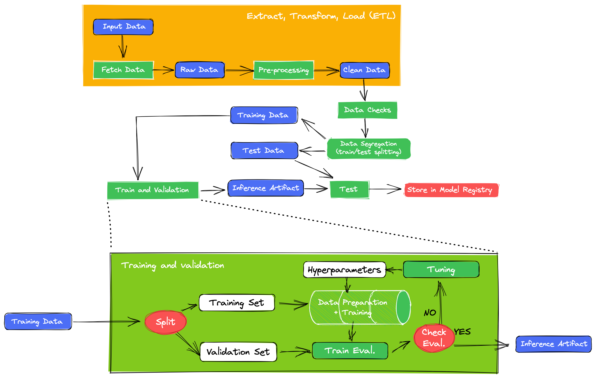
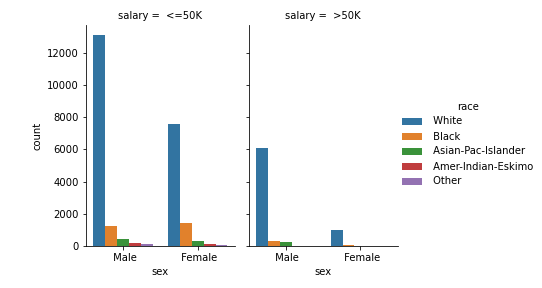
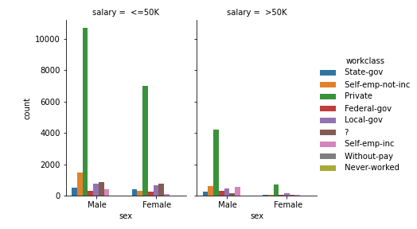

# Model Card

Model cards are a succinct approach for documenting the creation, use, and shortcomings of a model. The idea is to write a documentation such that a non-expert can understand the model card's contents. For additional information see the Model Card paper: https://arxiv.org/pdf/1810.03993.pdf

## Model Details
Ivanovitch Silva created the model. A complete data pipeline was built using Google Colab, Scikit-Learn and Weights & Bias to train a Decision Tree model. The big-picture of the data pipeline is shown below:

For the sake of understanding, a simple hyperparameter-tuning was conducted using a Random Sweep of Wandb, and the hyperparameters values adopted in the train were:

- full_pipeline__num_pipeline__num_transformer__model: 2
- classifier__criterion: 'entropy'
- classifier__splitter: 'best'
- classifier__random_state: 41

## Intended Use
This model is used as a proof of concept for the evaluation of an entire data pipeline incorporating Machine Learning fundamentals. The data pipeline is composed of the following stages: a) ``fecht data``, b) ``eda``, c) ``preprocess``, d) ``check data``, e) ``segregate``, f) ``train`` and g) ``test``.

## Training Data

The dataset used in this project is based on individual income in the United States. The *data* is from the *1994 census*, and contains information on an individual's ``marital status, age, type of work, and more``. The target column, or what we want to predict, is whether individuals make *less than or equal to 50k a year*, or *more than 50k a year*.

You can download the data from the University of California, Irvine's [website](http://archive.ics.uci.edu/ml/datasets/Adult).

After the EDA stage of the data pipeline, it was noted that the training data is imbalanced when considered the target variable and some features (``sex``, ``race`` and ``workclass``. 

## Evaluation Data
The dataset under study is split into Train and Test during the ``Segregate`` stage of the data pipeline. 70% of the clean data is used to Train and the remaining 30% to Test. Additionally, 30% of the Train data is used for validation purposes (hyperparameter-tuning). 

## Metrics
In order to follow the performance of machine learning experiments, the project marked certains stage outputs of the data pipeline as metrics. The metrics adopted are: [accuracy](https://scikit-learn.org/stable/modules/generated/sklearn.metrics.accuracy_score.html), [f1](https://scikit-learn.org/stable/modules/generated/sklearn.metrics.f1_score.html#sklearn.metrics.f1_score), [precision](https://scikit-learn.org/stable/modules/generated/sklearn.metrics.precision_score.html#sklearn.metrics.precision_score), [recall](https://scikit-learn.org/stable/modules/generated/sklearn.metrics.recall_score.html#sklearn.metrics.recall_score).

To calculate the evaluations metrics is only necessary to run:

The follow results will be shown:

 **Stage [Run]**                        | **Accuracy** | **F1** | **Precision** | **Recall** | 
---------------------------------|--------------|--------|---------------|------------|
 Train [distinctive-sweep-7](https://wandb.ai/ivanovitchm/decision_tree/runs/f40ujfaq/overview?workspace=user-ivanovitchm) | 0.8109       | 0.6075 | 0.6075        | 0.6075     |  
 Test [crips-resonance-11](https://wandb.ai/ivanovitchm/decision_tree/runs/1wg7ibyy/overview?workspace=user-ivanovitchm)  | 0.8019       | 0.5899 | 0.5884        | 0.5914     |

## Ethical Considerations

We may be tempted to claim that this dataset contains the only attributes capable of predicting someone's income. However, we know that is not true, and we will need to deal with the class imbalances somehow.

## Caveats and Recommendations
It should be noted that the model trained in this project was used only for validation of a complete data pipeline. It is notary that some important issues related to dataset imbalances exist, and adequate techniques need to be adopted in order to balance it.